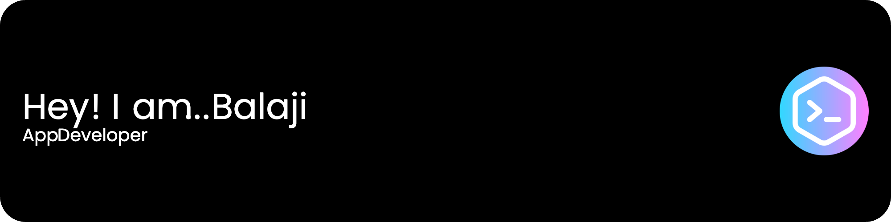

# Hi there 👋
I'm Balaji Pillalamarri, a final year BTech student at the University of Delhi. Currently, I'm working as a Flutter developer at Persist Ventures and expanding my interests in app development by learning iOS development.

- 🔭 I’m currently working on: Flutter projects at Persist Ventures
- 🌱 I’m currently learning: iOS development
- 😄 Pronouns: He/Him
- 🤝 Feel free to reach out for collaboration or just to connect!
# Skills and TechStack
- 📚 Java,Python,Dart
- 💻 Flutter, Swift

  

  

  

